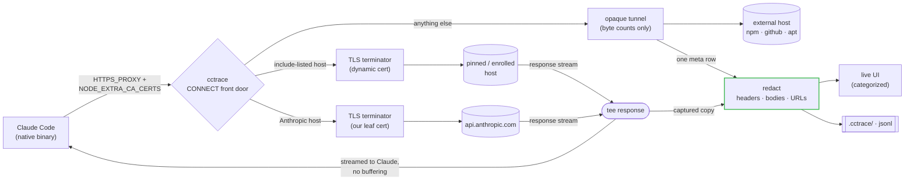

<p align="center"></p>

# cctrace

> **See what your coding agent really sends.**
>
> Every request Claude Code makes -- messages, OAuth, usage/credits, MCP --
> captured live in your browser. Codex, Grok, and Kimi Code too.

English | [简体中文](README.zh-CN.md)

[](https://github.com/thevibeworks/cctrace/actions/workflows/test.yml)
[](https://github.com/thevibeworks/cctrace/tags)
[](LICENSE)
[](https://bun.sh)

[Docs](https://thevibeworks.github.io/cctrace/) · [Install](#quick-start) · [Web UI](docs/web-ui.md) · [Saved traces](docs/traces.md) · [Beyond Claude](docs/clients.md) · [llms.txt](llms.txt)

<sub>AI agents / LLMs: read [/llms.txt](llms.txt); an agent skill ships in [skills/cctrace](skills/cctrace/SKILL.md).</sub>

<p align="center">
  
</p>

cctrace sits between your coding agent and its API, recording every HTTP
call to a live categorized web UI and a `.jsonl` trace you can reopen any
time with `cctrace view`. No cloud, no account, nothing leaves your machine.

```bash
cctrace                # trace Claude Code
cctrace codex          # or the OpenAI Codex CLI
cctrace grok           # or the Grok CLI
cctrace kimi           # or the Kimi Code CLI (Moonshot AI)
```

That's it. The agent launches normally. You get a browser tab showing
everything it does.

## Why

cctrace is built for exactly two jobs:

1. **LLM tracing** -- see exactly what your agent sends and receives each
   turn: system prompt, context, tool definitions, streamed replies,
   token/cache usage.
2. **Security & privacy tracing** -- audit what actually leaves your machine:
   which hosts get contacted, what telemetry goes out, what's inside every
   payload.

Both jobs need the full picture -- every request, not just the convenient
ones. Claude Code ships as a Bun-compiled **native binary**, so the classic
`node --require` fetch-hook is dead. cctrace captures at the transport
layer instead: a zero-config **TLS-intercepting proxy** (Charles-style)
that the agent routes through via `HTTPS_PROXY`, trusting an auto-generated
CA. Intercepting below where URLs are built is what reaches the OAuth and
usage/credit endpoints a base-URL proxy physically cannot see -- and since
0.16 the scope is deliberate: first-party hosts are decrypted, everything
else (npm, GitHub, apt) passes through as an opaque byte-counted tunnel.

## What you get

- **The full picture.** `/v1/messages`, OAuth, **usage/credits**, MCP registry,
  bootstrap, telemetry -- not just the chat endpoint.
- **Live, categorized UI.** Filter chips with counts, decoded SSE streams,
  prompt-cache verdicts, first-token latency, estimated cost per request.
  The [full tour](docs/web-ui.md).
- **Reconstructed sessions.** Threads, subagent branches, `/model` epochs,
  compaction boundaries, superseded exchanges -- and **replay**: step or
  play back any captured session, deep-link any moment.
- **Replayable traces.** Every run writes a `.jsonl`; `cctrace view` reopens
  it anytime, `--html` renders an offline snapshot you can send around.
- **Zero config.** Auto-generates its CA, auto-detects your install, full
  first-party capture by default.
- **Scoped by design.** External hosts your agent's subprocesses contact
  pass through as opaque tunnels (host + byte counts) -- a `go install`
  never lands 53MB of tarball in your trace. Details in
  [capture modes](docs/capture-modes.md).
- **Safe by default.** Credentials are redacted from headers, bodies, *and*
  URLs before anything hits disk
  (see [Security & privacy](#security--privacy)).

## How it compares

|  | **cctrace** | base-URL proxy | claude-trace (`node --require`) | Charles / mitmproxy |
|---|:---:|:---:|:---:|:---:|
| Works on the native binary | yes | yes | **no** | yes |
| Captures `/v1/messages` | yes | yes | yes | yes |
| Captures **OAuth / usage / credits** | yes | **no** | **no** | manual |
| Zero config (auto CA + trust) | yes | yes | yes | **no** |
| Agent-aware UI (categories, sessions, SSE decode) | yes | -- | partial | **no** |
| Local-only, nothing leaves your machine | yes | yes | yes | yes |

The `fetch()`-hook approach (claude-trace and friends) stopped working when
Claude Code went native. A base-URL proxy still works but only sees
`/v1/messages`. A general TLS proxy sees everything but needs manual CA
setup and knows nothing about the endpoints. cctrace is the middle path:
zero-config, whole first-party picture, and it speaks your agent's wire.

## Quick start

Requires [Bun](https://bun.sh), `openssl`, and the CLI you want to trace.

```bash
npm install -g @thevibeworks/cctrace    # or: bunx @thevibeworks/cctrace
```

Or build the standalone binary (recommended -- no Bun at runtime, exact
`--` pass-through):

```bash
git clone https://github.com/thevibeworks/cctrace && cd cctrace
make install                            # compiles, installs to ~/.local/bin
```

Then:

```bash
cctrace                                    # trace claude, open the live UI
cctrace -- --continue                      # resume your last session, traced
cctrace -- -p "hello"                      # args after -- go to the agent verbatim
```

```
[cctrace] Live UI: http://localhost:9317
[cctrace] Capture: MITM proxy http://127.0.0.1:44775 (all Anthropic hosts)
```

Open the Live UI and watch requests stream in. Ctrl-C when done -- the
`.jsonl` stays in `.cctrace/`; reopen anytime with `cctrace view`.
Install variants, runtime notes, and the bun `--` caveat:
[docs/install.md](docs/install.md).

## Everyday commands

```bash
cctrace view                     # reopen a saved trace (Enter = newest)
cctrace view <target> --html     # render a shareable offline snapshot
cctrace ps                       # live instances: URL, client, project, session
cctrace clean|merge|compress     # housekeeping -- dry-run by default, --yes applies
cctrace purge                    # drop noise categories from saved traces
cctrace compact                  # fold redundant bodies (-95%+), view unchanged
```

Housekeeping never shrinks your data (verified deletes, union merges,
live-append safety); `compact` is the one stated exception. The full
guarantees: [docs/traces.md](docs/traces.md).

## Common options

| Option | Description |
|--------|-------------|
| `--mode MODE` | `auto` (default), `mitm`, `base-url`, `node` |
| `-p, --port PORT` | Live UI port (default: 9317, auto-falls back) |
| `--messages-only` | Capture only the model API calls |
| `--capture-external` | Decrypt every host (bodies over 64KB summarized) |
| `--intercept-host H` | Also decrypt host `H` (repeatable -- remote MCP servers) |
| `--dir PATH` | Log directory (default: `.cctrace`) |
| `--client-path PATH` | Custom binary path for any client |

Full table incl. `--fresh`, `--with`, `--data-dir`, `--print-ca`:
[docs/install.md](docs/install.md#all-options).

## How it works



The proxy terminates TLS with an auto-generated leaf cert, forwards to the
real API, and `tee`s the response so the agent gets bytes immediately while
cctrace captures a copy -- zero SSE buffering. Every captured pair is
redacted before it reaches any sink. Subprocess trust (the combined CA
bundle), why `HTTP_PROXY` stays unset, and the tunnel scope model:
[docs/capture-modes.md](docs/capture-modes.md).

## Security & privacy

cctrace is a local debugging tool, but it intercepts real credentialed
traffic, so it redacts before writing anything:

- **Headers** -- `authorization`, `x-api-key`, `cookie`, etc. masked to a
  first-10/last-4 preview (enough to tell *which* key, not the key itself).
- **Bodies** -- credential fields (`access_token`, `refresh_token`,
  `client_secret`, `api_key`, ...) masked in JSON and form bodies. Your
  conversation content is left intact.
- **URLs** -- credential-bearing query params (e.g. OAuth `?code=`) masked.

Redaction happens at a single choke point, so it applies uniformly to the
`.jsonl`, the `.html`, and the live WebSocket. `.cctrace/` output is
gitignored by default.

**Still:** a trace is a record of your real session. Review it before
sharing. Never paste raw output into a public issue. Seriously.

## Docs

| Start here | Go deeper |
|---|---|
| [Install & options](docs/install.md) | [Capture modes & proxy internals](docs/capture-modes.md) |
| [The web UI tour](docs/web-ui.md) | [Saved traces & housekeeping](docs/traces.md) |
| [Codex / Grok / Kimi / providers](docs/clients.md) | [Agent skill](skills/cctrace/SKILL.md) · [CHANGELOG](CHANGELOG.md) |

## Roadmap

- **Session replay P3/P4** -- opt-in `--record-timing` for chunk-timed
  streaming replay ([design](docs/design/session-replay.md)).
- **WebSocket relay** -- capture ws frames instead of the current fast
  refusal + HTTP fallback.
- **Conversation dump** -- export the reconstructed conversation as
  Markdown or JSON.
- **MCP server** -- query captured traffic from any agent (the agent
  *skill* already ships; the MCP surface is the remaining half).
- **Tunnel PID attribution** -- which subprocess called npm (Linux,
  investigated, deferred).

## Development

```bash
bun test                                # unit tests
bun run tests/e2e-live.ts mitm "hi"     # end-to-end against real Claude
```

See [CONTRIBUTING.md](CONTRIBUTING.md).

## License

[MIT](LICENSE)
