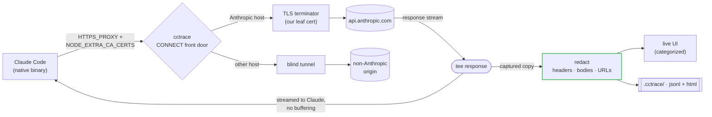

<p align="center"></p>

# cctrace

> Every request Claude Code makes — messages, OAuth, usage/credits, MCP —
> captured live in your browser.

English | [简体中文](README.zh-CN.md)

[](https://github.com/thevibeworks/cctrace/actions/workflows/test.yml)
[](https://github.com/thevibeworks/cctrace/tags)
[](LICENSE)
[](https://bun.sh)

<p align="center">
  
</p>

cctrace runs Claude Code normally and records every HTTP call it makes to a
local, categorized web UI — then saves a self-contained HTML report you can open
any time. No cloud, no account, nothing leaves your machine.

```bash
cctrace
```

## Why

Claude Code ships as a Bun-compiled **native binary**. The classic trick of
injecting a `fetch()` hook with `node --require` doesn't work on a native binary
anymore. cctrace captures traffic the way it actually works today: a local
**TLS-intercepting proxy** (Charles/mitmproxy-style, but zero-config) that Claude
routes through via `HTTPS_PROXY`, trusting an auto-generated CA. Because it
intercepts at the transport layer — below where URLs are built — it sees
**everything**, including the OAuth and usage/credit endpoints that a base-URL
proxy physically cannot reach (Claude hardcodes their host).

## What you get

- **The full picture.** `/v1/messages`, OAuth, **usage/credits**, MCP registry,
  bootstrap, telemetry — not just the chat endpoint.
- **Live, categorized UI.** Filter chips with counts, colored badges, expandable
  headers/bodies, decoded SSE streams.
- **Shareable snapshots.** Every run writes a self-contained `.html` that renders
  the same UI offline, with no server.
- **Zero config.** Auto-generates its CA, auto-detects your Claude install, and
  captures everything by default.
- **Safe by default.** Runs entirely local; credentials are redacted from
  headers, bodies, *and* URLs before anything hits disk (see
  [Security & privacy](#security--privacy)).

## How it compares

|  | **cctrace** | base-URL proxy | claude-trace (`node --require`) | Charles / mitmproxy |
|---|:---:|:---:|:---:|:---:|
| Works on the native binary | ✅ | ✅ | ❌ | ✅ |
| Captures `/v1/messages` | ✅ | ✅ | ✅ | ✅ |
| Captures **OAuth / usage / credits** | ✅ | ❌ | ❌ | manual |
| Zero config (auto CA + trust) | ✅ | ✅ | ✅ | ❌ |
| Claude-aware UI (categories, SSE decode) | ✅ | — | partial | ❌ |
| Local-only, nothing leaves your machine | ✅ | ✅ | ✅ | ✅ |

The `fetch()`-hook approach (claude-trace and friends) stopped working when
Claude Code went native. A base-URL proxy still works but only sees
`/v1/messages`. A general TLS proxy like Charles sees everything but needs manual
CA setup and knows nothing about Claude's endpoints. cctrace is the middle path:
zero-config, sees everything, and speaks Claude.

## Quick start

Requires [Bun](https://bun.sh), `openssl`, and Claude Code (`claude` on PATH).

```bash
git clone https://github.com/thevibeworks/cctrace
cd cctrace
bun install
bun link            # optional: puts `cctrace` on your PATH
```

Then just run it:

```bash
cctrace                       # auto: capture everything, open the live UI
cctrace -- -p "hello"         # pass args straight through to Claude
```

On start you'll see:

```
[cctrace] Live UI: http://localhost:9317
[cctrace] Capture: MITM proxy http://127.0.0.1:44775 (all Anthropic hosts)
```

Open the **Live UI** URL and watch requests stream in. On exit, cctrace prints
the path to a saved `.cctrace/trace-<timestamp>.html`.

## Running cctrace (Bun & `bin`)

cctrace **runs on [Bun](https://bun.sh)** — the CLI is `src/cli.ts` executed
directly (shebang `#!/usr/bin/env bun`). There is no compiled JS and no Node
fallback; everything uses `Bun.serve`/`Bun.spawn`.

| Command | Works | Notes |
|---|---|---|
| `bun run src/cli.ts [args]` | ✅ | from a clone |
| `bun start` | ✅ | alias of the above |
| `./src/cli.ts` | ✅ | direct exec via the Bun shebang |
| `cctrace` (after `bun link`) | ✅ | needs `~/.bun/bin` on your `PATH` |
| `node …/cli.ts` / `npm i -g` without Bun | ❌ | fails loudly: `env: 'bun': No such file or directory` |

**Prerequisites — all three matter:**

- **Bun** — the runtime, not just for install.
- **`openssl` on `PATH`** — `mitm` mode shells out to it to generate the CA +
  leaf cert. No openssl → use `--mode base-url` (no CA needed).
- **A real Claude Code install** — auto mode reads the magic bytes of your
  `claude` binary to pick the mode. No `claude` on PATH → cctrace exits with
  `Claude not found` (or pass `--claude-path`).

> Want a standalone binary with no Bun at runtime? `bun build --compile
> src/cli.ts --outfile cctrace` produces one for your platform.

## Capture modes

cctrace auto-selects based on your Claude install; override with `--mode`.

| Mode | Captures | Setup |
|------|----------|-------|
| **`mitm`** (default, native binaries) | **Everything** — messages, OAuth, usage/credits, MCP, telemetry | Auto-generates a CA; Claude trusts it via `NODE_EXTRA_CA_CERTS` |
| **`base-url`** | `/v1/messages` only | Zero — just sets `ANTHROPIC_BASE_URL` |
| **`node`** (auto for npm/JS installs) | Everything via `fetch()` hook | Legacy; only works on non-native (JS) Claude |

Non-Anthropic hosts are **blind-tunneled** through untouched — cctrace only
terminates TLS for hosts it can present a valid cert for, so it never breaks a
connection it can't forge.

## The web UI

- **Category filter chips** with live counts: Messages · Usage/Credits · OAuth ·
  MCP · Bootstrap · Telemetry · Other. Click to filter; combine with text search.
- **Colored category badge** on every request row.
- **Expandable** request/response headers and bodies; SSE streams are decoded.
- **Offline snapshots** — the saved `.html` embeds the trace and renders the same
  UI with no server.

## Options

| Option | Description |
|--------|-------------|
| `--mode MODE` | `auto` (default), `mitm`, `base-url`, `node` |
| `-s, --static` | Static mode (no live server, just files) |
| `-p, --port PORT` | Live UI port (default: 9317; auto-falls back if busy) |
| `--messages-only` | Capture only `/v1/messages` |
| `--no-open` | Don't auto-open the browser |
| `--print-ca` | Print the MITM CA cert path and exit |
| `--log NAME` | Custom log file base name |
| `--dir PATH` | Log directory (default: `.cctrace`) |
| `--claude-path PATH` | Custom Claude binary path |

## Output

Every run writes to `.cctrace/` (or `--dir`):

- `trace-<timestamp>.jsonl` — one request/response pair per line
- `trace-<timestamp>.html` — self-contained categorized viewer

## How it works



The proxy terminates TLS with an auto-generated leaf cert (Anthropic SANs),
forwards to the real API, and `tee`s the response stream so Claude gets bytes
immediately while cctrace captures a copy — no buffering of SSE responses. Every
captured pair is redacted before it reaches any sink.

We inject only two things into Claude: `HTTPS_PROXY` (to route it through us) and
`NODE_EXTRA_CA_CERTS` (which *appends* our CA to Bun's trust store, so Claude
trusts our leaf while public TLS still works). We deliberately do **not** set
`SSL_CERT_FILE` or `HTTP_PROXY` — those leak into Claude's subprocesses (the
bash tool's `curl`/`python`, MCP servers) and would break their networking.

## Security & privacy

cctrace is a local debugging tool, but it intercepts real credentialed traffic,
so it redacts before writing anything:

- **Headers** — `authorization`, `x-api-key`, `cookie`, … are masked to a
  first-10/last-4 preview (enough to tell *which* key, not the key).
- **Bodies** — credential fields (`access_token`, `refresh_token`,
  `client_secret`, `code`, `api_key`, …) are masked in JSON and form-encoded
  bodies. Your `/v1/messages` conversation content is left intact.
- **URLs** — credential-bearing query params (e.g. OAuth `?code=`) are masked.

Redaction happens at a single choke point, so it applies uniformly to the
`.jsonl`, the shareable `.html`, and the live WebSocket. The `.cctrace/` output
is gitignored by default. Still: a trace is a record of your real session —
review it before sharing, and never paste raw output into a public issue.

## Roadmap

- **Conversation view** — an interactive mode that reconstructs a *full LLM
  interaction* from the raw capture: system prompt, message turns, tool
  definitions, tool calls and their results, and the streamed assistant reply
  decoded from the SSE events — rendered as one readable conversation instead of
  a wire-level request/response dump. The wire view stays; this reads the same
  bytes at the conversation layer.

See [CHANGELOG.md](CHANGELOG.md) for released changes.

## Development

```bash
bun test                                # unit tests
bun run tests/e2e-live.ts mitm "hi"     # end-to-end against real Claude
```

See [CONTRIBUTING.md](CONTRIBUTING.md).

## License

[MIT](LICENSE)
