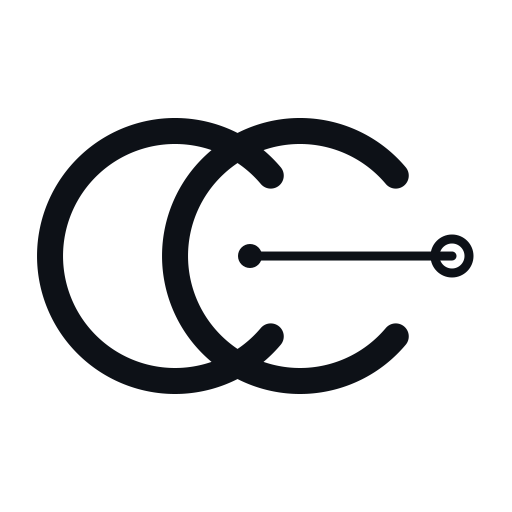
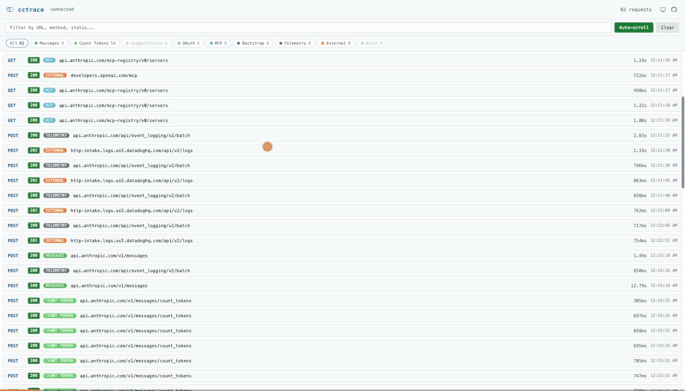
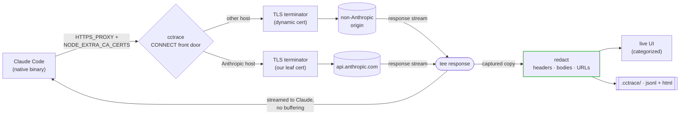

<p align="center"></p>

# cctrace

> **See what Claude really says.**
>
> Every request Claude Code makes -- messages, OAuth, usage/credits, MCP --
> captured live in your browser.

English | [简体中文](README.zh-CN.md)

[](https://github.com/thevibeworks/cctrace/actions/workflows/test.yml)
[](https://github.com/thevibeworks/cctrace/tags)
[](LICENSE)
[](https://bun.sh)

<p align="center">
  
</p>

cctrace sits between Claude Code and the Anthropic API, recording every HTTP
call to a live categorized web UI -- then saves a self-contained HTML snapshot
you can open any time. No cloud, no account, nothing leaves your machine.

```bash
cctrace
```

That's it. Claude launches normally. You get a browser tab showing everything
it does.

## Why

Claude Code ships as a Bun-compiled **native binary**. The classic trick of
injecting a `fetch()` hook with `node --require` doesn't work on a native
binary -- it's dead, Jim. cctrace captures traffic the way it actually works
today: a local **TLS-intercepting proxy** (Charles/mitmproxy-style, but
zero-config) that Claude routes through via `HTTPS_PROXY`, trusting an
auto-generated CA.

Because it intercepts at the transport layer -- below where URLs are built --
it sees **everything**, including the OAuth and usage/credit endpoints that a
base-URL proxy physically cannot reach (Claude hardcodes their host).

## What you get

- **The full picture.** `/v1/messages`, OAuth, **usage/credits**, MCP registry,
  bootstrap, telemetry -- not just the chat endpoint.
- **Live, categorized UI.** Filter chips with counts, colored badges, expandable
  headers/bodies, decoded SSE streams. It looks good. You'll actually want to
  keep it open.
- **Shareable snapshots.** Every run writes a self-contained `.html` that
  renders the same UI offline, no server needed. Send it to a colleague.
- **Zero config.** Auto-generates its CA, auto-detects your Claude install, and
  captures everything by default. No config files to edit, no flags to memorize.
- **Safe by default.** Credentials are redacted from headers, bodies, *and* URLs
  before anything hits disk (see [Security & privacy](#security--privacy)).
  Your API keys stay your API keys.

## How it compares

|  | **cctrace** | base-URL proxy | claude-trace (`node --require`) | Charles / mitmproxy |
|---|:---:|:---:|:---:|:---:|
| Works on the native binary | yes | yes | **no** | yes |
| Captures `/v1/messages` | yes | yes | yes | yes |
| Captures **OAuth / usage / credits** | yes | **no** | **no** | manual |
| Zero config (auto CA + trust) | yes | yes | yes | **no** |
| Claude-aware UI (categories, SSE decode) | yes | -- | partial | **no** |
| Local-only, nothing leaves your machine | yes | yes | yes | yes |

The `fetch()`-hook approach (claude-trace and friends) stopped working when
Claude Code went native. A base-URL proxy still works but only sees
`/v1/messages` -- you're flying blind on OAuth, usage, and credits. A general
TLS proxy like Charles sees everything but needs manual CA setup and knows
nothing about Claude's endpoints. cctrace is the middle path: zero-config,
sees everything, and speaks Claude.

## Quick start

Requires [Bun](https://bun.sh), `openssl`, and Claude Code (`claude` on PATH).

### Install from npm

```bash
npm install -g @thevibeworks/cctrace
```

### Or run without installing

```bash
bunx @thevibeworks/cctrace
```

### Or clone the repo

```bash
git clone https://github.com/thevibeworks/cctrace
cd cctrace
bun install
bun link            # optional: puts `cctrace` on your PATH
```

Then just run it:

```bash
cctrace                       # capture everything, open the live UI
cctrace -- -p "hello"         # pass args straight through to Claude
```

On start you'll see:

```
[cctrace] Live UI: http://localhost:9317
[cctrace] Capture: MITM proxy http://127.0.0.1:44775 (all Anthropic hosts)
```

Open the **Live UI** URL and watch requests stream in. When you're done, hit
Ctrl-C -- cctrace prints the path to a saved `.cctrace/trace-<timestamp>.html`.

## Running cctrace (Bun & `bin`)

cctrace **runs on [Bun](https://bun.sh)** -- the CLI is `src/cli.ts` executed
directly (shebang `#!/usr/bin/env bun`). There is no compiled JS and no Node
fallback; everything uses `Bun.serve`/`Bun.spawn`.

| Command | Works | Notes |
|---|---|---|
| `bun run src/cli.ts [args]` | yes | from a clone |
| `bun start` | yes | alias of the above |
| `./src/cli.ts` | yes | direct exec via the Bun shebang |
| `cctrace` (after `bun link`) | yes | needs `~/.bun/bin` on your `PATH` |
| `node .../cli.ts` / `npm i -g` without Bun | **no** | fails loudly: `env: 'bun': No such file or directory` |

**Prerequisites -- all three matter:**

- **Bun** -- the runtime, not just for install. If you don't have Bun,
  nothing works. [Install it](https://bun.sh).
- **`openssl` on `PATH`** -- `mitm` mode shells out to it to generate the CA +
  leaf cert. No openssl? Use `--mode base-url` (no CA needed, but you only
  see messages).
- **A real Claude Code install** -- auto mode reads the magic bytes of your
  `claude` binary to pick the capture mode. No `claude` on PATH? cctrace
  exits with `Claude not found` (or pass `--claude-path`).

> **Want a standalone binary with no Bun at runtime?** `bun build --compile
> src/cli.ts --outfile cctrace` produces one for your platform.

## Capture modes

cctrace auto-selects based on your Claude install; override with `--mode`.

| Mode | Captures | Setup |
|------|----------|-------|
| **`mitm`** (default, native binaries) | **Everything** -- messages, OAuth, usage/credits, MCP, telemetry | Auto-generates a CA; Claude trusts it via `NODE_EXTRA_CA_CERTS` |
| **`base-url`** | `/v1/messages` only | Zero -- just sets `ANTHROPIC_BASE_URL` |
| **`node`** (auto for npm/JS installs) | Everything via `fetch()` hook | Legacy; only works on non-native (JS) Claude |

Non-Anthropic hosts are **fully intercepted** too -- cctrace dynamically
generates a TLS cert for each host (signed by the same CA), so you see the
complete request and response for everything Claude contacts. External
traffic gets its own filter category in the UI.

## The web UI

- **Category filter chips** with live counts: Messages, Usage/Credits, OAuth,
  MCP, Bootstrap, Telemetry, Other. Click to filter; combine with text search.
- **Colored category badge** on every request row.
- **Expandable** request/response headers and bodies; SSE streams are decoded
  into readable events.
- **Offline snapshots** -- the saved `.html` embeds the full trace and renders
  the same UI with no server. Open it a year from now, it still works.

## Options

| Option | Description |
|--------|-------------|
| `--mode MODE` | `auto` (default), `mitm`, `base-url`, `node` |
| `-s, --static` | Static mode (no live server, just files) |
| `-p, --port PORT` | Live UI port (default: 9317; auto-falls back if busy) |
| `--messages-only` | Capture only `/v1/messages` |
| `--no-open` | Don't auto-open the browser |
| `--print-ca` | Print the MITM CA cert path and exit |
| `--log NAME` | Custom log file base name |
| `--dir PATH` | Log directory (default: `.cctrace`) |
| `--claude-path PATH` | Custom Claude binary path |

## Output

Every run writes to `.cctrace/` (or `--dir`):

- `trace-<timestamp>.jsonl` -- one request/response pair per line (machine-readable)
- `trace-<timestamp>.html` -- self-contained categorized viewer (human-readable)

## How it works



The proxy terminates TLS with an auto-generated leaf cert (Anthropic SANs),
forwards to the real API, and `tee`s the response stream so Claude gets bytes
immediately while cctrace captures a copy -- zero buffering of SSE responses.
Every captured pair is redacted before it reaches any sink.

We inject only two things into Claude's environment: `HTTPS_PROXY` (to route
traffic through us) and `NODE_EXTRA_CA_CERTS` (which *appends* our CA to Bun's
trust store, so Claude trusts our leaf while public TLS still works).

We deliberately do **not** set `SSL_CERT_FILE` or `HTTP_PROXY` -- those leak
into Claude's subprocesses (the bash tool's `curl`/`python`, MCP servers) and
would break their networking. That's the kind of bug that makes you question
your life choices at 2 AM.

## Security & privacy

cctrace is a local debugging tool, but it intercepts real credentialed traffic,
so it redacts before writing anything:

- **Headers** -- `authorization`, `x-api-key`, `cookie`, etc. are masked to a
  first-10/last-4 preview (enough to tell *which* key, not the key itself).
- **Bodies** -- credential fields (`access_token`, `refresh_token`,
  `client_secret`, `code`, `api_key`, ...) are masked in JSON and form-encoded
  bodies. Your `/v1/messages` conversation content is left intact.
- **URLs** -- credential-bearing query params (e.g. OAuth `?code=`) are masked.

Redaction happens at a single choke point, so it applies uniformly to the
`.jsonl`, the shareable `.html`, and the live WebSocket. The `.cctrace/` output
is gitignored by default.

**Still:** a trace is a record of your real session. Review it before sharing.
Never paste raw output into a public issue. Seriously.

## Roadmap

- **Session view** -- a split-pane mode that reconstructs a *full LLM
  conversation* from the raw capture: system prompt, message turns, tool
  definitions, tool calls and their results, and the streamed assistant reply
  decoded from SSE events. Wire view on the left, readable conversation on the
  right. The wire view stays; this reads the same bytes at the conversation
  layer.
- **Conversation dump** -- export the reconstructed conversation as Markdown
  or JSON, ready for sharing or post-mortem analysis.
- **Agent skill** -- a purpose-built Claude Code skill/MCP server for
  interacting with cctrace programmatically: query captured traffic, inspect
  specific requests, export conversations.
- **Multi-session live view** -- run multiple cctrace sessions without port
  conflicts by routing each session to a path like
  `http://localhost:9317/<project>/<session-id>`.
- **Token metrics** -- per-turn and cumulative token usage, cache hit rates,
  cost estimates, and `service_tier` / `inference_geo` visibility.

See [CHANGELOG.md](CHANGELOG.md) for released changes.

## Development

```bash
bun test                                # unit tests
bun run tests/e2e-live.ts mitm "hi"     # end-to-end against real Claude
```

See [CONTRIBUTING.md](CONTRIBUTING.md).

## License

[MIT](LICENSE)
