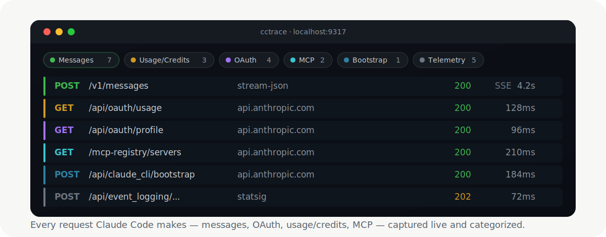

# cctrace

> 捕获 Claude Code 发出的每一个请求 —— messages、OAuth、用量/额度、MCP ——
> 在浏览器里实时查看。

[English](README.md) | 简体中文

[](https://github.com/thevibeworks/cctrace/actions/workflows/test.yml)
[](https://github.com/thevibeworks/cctrace/tags)
[](LICENSE)
[](https://bun.sh)

<p align="center">
  
</p>

cctrace 会照常运行 Claude Code，同时把它发出的每一个 HTTP 请求记录到本地的分类
Web 界面，并在结束时保存一份可随时打开的自包含 HTML 报告。无云端、无账号，数据不
离开你的机器。

```bash
cctrace
```

## 为什么这样做

Claude Code 现在以 Bun 编译的**原生二进制**形式分发。过去用 `node --require` 注入
`fetch()` 钩子的老办法，对原生二进制已经失效。cctrace 采用如今真正可行的方式来抓
包：一个本地的 **TLS 拦截代理**（类似 Charles/mitmproxy，但零配置）。Claude 通过
`HTTPS_PROXY` 走这个代理，并信任一个自动生成的 CA。因为拦截发生在传输层 —— 在 URL
构造之前 —— 所以它能看到**全部流量**，包括 base-url 代理在物理上无法触及的 OAuth
和用量/额度端点（它们的 host 被 Claude 硬编码了）。

## 你能得到什么

- **完整的全貌。** `/v1/messages`、OAuth、**用量/额度**、MCP registry、bootstrap、
  遥测 —— 不只是聊天端点。
- **实时分类界面。** 带计数的筛选标签、彩色徽章、可展开的 headers/bodies、已解码的
  SSE 流。
- **可分享的快照。** 每次运行都会写出一份自包含的 `.html`，可离线渲染出同样的界面，
  无需服务器。
- **零配置。** 自动生成 CA、自动识别你的 Claude 安装、默认捕获全部流量。
- **默认安全。** 全程本地运行；凭据在落盘之前会从 headers、bodies **和** URL 中被
  脱敏（见 [安全与隐私](#安全与隐私)）。

## 对比

|  | **cctrace** | base-URL 代理 | claude-trace（`node --require`） | Charles / mitmproxy |
|---|:---:|:---:|:---:|:---:|
| 支持原生二进制 | ✅ | ✅ | ❌ | ✅ |
| 捕获 `/v1/messages` | ✅ | ✅ | ✅ | ✅ |
| 捕获 **OAuth / 用量 / 额度** | ✅ | ❌ | ❌ | 需手动 |
| 零配置（自动 CA 与信任） | ✅ | ✅ | ✅ | ❌ |
| 懂 Claude 的界面（分类、SSE 解码） | ✅ | — | 部分 | ❌ |
| 纯本地，数据不外流 | ✅ | ✅ | ✅ | ✅ |

`fetch()` 钩子方案（claude-trace 之类）在 Claude Code 转向原生二进制后就失效了。
base-URL 代理仍然可用，但只能看到 `/v1/messages`。像 Charles 这样的通用 TLS 代理
能看到一切，却需要手动装 CA，而且对 Claude 的端点一无所知。cctrace 走的是中间路线：
零配置、看得全、还懂 Claude。

## 快速开始

需要 [Bun](https://bun.sh)、`openssl`，以及已安装的 Claude Code（`claude` 在
PATH 中）。

```bash
git clone https://github.com/thevibeworks/cctrace
cd cctrace
bun install
bun link            # 可选：把 `cctrace` 加入 PATH
```

然后直接运行：

```bash
cctrace                       # 自动模式：捕获全部，打开实时界面
cctrace -- -p "hello"         # 把参数原样传给 Claude
```

启动时你会看到：

```
[cctrace] Live UI: http://localhost:9317
[cctrace] Capture: MITM proxy http://127.0.0.1:44775 (all Anthropic hosts)
```

打开 **Live UI** 链接即可看到请求实时流入。退出时，cctrace 会打印所保存的
`.cctrace/trace-<timestamp>.html` 路径。

## 运行方式（Bun 与 `bin`）

cctrace **运行在 [Bun](https://bun.sh) 上** —— CLI 就是直接执行的 `src/cli.ts`
（shebang 为 `#!/usr/bin/env bun`）。没有编译后的 JS，也没有 Node 回退；一切都用
`Bun.serve`/`Bun.spawn`。

| 命令 | 可用 | 说明 |
|---|---|---|
| `bun run src/cli.ts [args]` | ✅ | 在克隆的仓库里 |
| `bun start` | ✅ | 上一条的别名 |
| `./src/cli.ts` | ✅ | 借助 Bun shebang 直接执行 |
| `cctrace`（`bun link` 之后） | ✅ | 需要 `~/.bun/bin` 在 PATH 中 |
| 无 Bun 的 `node …/cli.ts` / `npm i -g` | ❌ | 会明确报错：`env: 'bun': No such file or directory` |

**三个前置条件缺一不可：**

- **Bun** —— 运行时，而不只是用来安装。
- **PATH 中的 `openssl`** —— `mitm` 模式靠它生成 CA 与叶子证书。没有 openssl 就用
  `--mode base-url`（无需 CA）。
- **真实的 Claude Code 安装** —— 自动模式会读取你 `claude` 二进制的魔数来选择模式。
  PATH 中没有 `claude` 时，cctrace 会以 `Claude not found` 退出（或用
  `--claude-path` 指定）。

> 想要一个运行时无需 Bun 的独立二进制？`bun build --compile src/cli.ts
> --outfile cctrace` 会为你的平台生成一个。

## 捕获模式

cctrace 会根据你的 Claude 安装自动选择；用 `--mode` 可强制指定。

| 模式 | 捕获范围 | 配置 |
|------|----------|------|
| **`mitm`**（原生二进制默认） | **全部** —— messages、OAuth、用量/额度、MCP、遥测 | 自动生成 CA；Claude 通过 `NODE_EXTRA_CA_CERTS` 信任它 |
| **`base-url`** | 仅 `/v1/messages` | 零配置 —— 只设置 `ANTHROPIC_BASE_URL` |
| **`node`**（npm/JS 安装自动选用） | 通过 `fetch()` 钩子捕获全部 | 遗留方案；仅适用于非原生（JS）Claude |

非 Anthropic 的 host 会被**盲隧道**原样透传 —— cctrace 只对能出示有效证书的 host
做 TLS 终止，因此绝不会破坏一个它无法伪造证书的连接。

## Web 界面

- **分类筛选标签**，带实时计数：Messages · Usage/Credits · OAuth · MCP ·
  Bootstrap · Telemetry · Other。点击筛选，可与文本搜索组合。
- 每一行请求上的**彩色分类徽章**。
- **可展开**的请求/响应 headers 与 bodies；SSE 流会被解码。
- **离线快照** —— 保存的 `.html` 内嵌了 trace，可在无服务器的情况下渲染出同样的界面。

## 选项

| 选项 | 说明 |
|--------|-------------|
| `--mode MODE` | `auto`（默认）、`mitm`、`base-url`、`node` |
| `-s, --static` | 静态模式（不启动实时服务器，只写文件） |
| `-p, --port PORT` | 实时界面端口（默认 9317；被占用时自动回退） |
| `--messages-only` | 只捕获 `/v1/messages` |
| `--no-open` | 不自动打开浏览器 |
| `--print-ca` | 打印 MITM CA 证书路径并退出 |
| `--log NAME` | 自定义日志文件基名 |
| `--dir PATH` | 日志目录（默认 `.cctrace`） |
| `--claude-path PATH` | 自定义 Claude 二进制路径 |

## 输出

每次运行都会写入 `.cctrace/`（或 `--dir`）：

- `trace-<timestamp>.jsonl` —— 每行一个请求/响应对
- `trace-<timestamp>.html` —— 自包含的分类查看器

## 工作原理

```
  Claude Code                cctrace                 Anthropic
  (native binary)          MITM proxy                api.anthropic.com
       |                       |                          |
       |  HTTPS_PROXY +        |                          |
       |  NODE_EXTRA_CA_CERTS  |                          |
       |---------------------->|  terminate TLS           |
       |                       |------------------------->|  forward (real TLS)
       |                       |<-------------------------|  response stream
       |<----------------------|  tee: one copy to Claude |
       |    (streamed, no      |       one copy captured  |
       |     buffering)        |                          |
                               v
                       redact -> live UI + .cctrace/*.{jsonl,html}
```

代理用自动生成的叶子证书（带 Anthropic SANs）终止 TLS，转发到真实 API，并对响应流做
`tee` —— Claude 立即拿到字节，cctrace 同时抓一份副本，SSE 响应完全不缓冲。每一个捕获
到的请求对，在进入任何落点之前都会先脱敏。

我们只往 Claude 注入两样东西：`HTTPS_PROXY`（让它走我们的代理）和
`NODE_EXTRA_CA_CERTS`（它会把我们的 CA **追加**到 Bun 的信任库，因此 Claude 在信任
我们叶子证书的同时，公网 TLS 仍然正常）。我们刻意**不**设置 `SSL_CERT_FILE` 或
`HTTP_PROXY` —— 它们会泄漏到 Claude 的子进程（bash 工具的 `curl`/`python`、MCP
服务器）里，破坏它们的网络。

## 安全与隐私

cctrace 是本地调试工具，但它拦截的是真实的带凭据流量，所以在写入任何东西之前都会先
脱敏：

- **Headers** —— `authorization`、`x-api-key`、`cookie` 等被掩码为「前 10/后 4」
  的预览（足以判断用了**哪个** key，但看不到 key 本身）。
- **Bodies** —— 凭据字段（`access_token`、`refresh_token`、`client_secret`、
  `code`、`api_key` 等）在 JSON 和 form-encoded body 中被掩码。你的 `/v1/messages`
  对话内容保持原样。
- **URL** —— 携带凭据的查询参数（如 OAuth 的 `?code=`）被掩码。

脱敏发生在单一的收口处，因此对 `.jsonl`、可分享的 `.html` 和实时 WebSocket 一视同仁。
`.cctrace/` 输出默认已被 gitignore。但请记住：一份 trace 就是你真实会话的记录 ——
分享前请先检查，切勿把原始输出贴到公开 issue 里。

## 路线图

- **对话视图** —— 一个交互式模式，从原始捕获中还原出一次*完整的 LLM 交互*：system
  prompt、消息轮次、工具定义、工具调用及其结果，以及从 SSE 事件解码出的流式助手回复
  —— 渲染成一段可读的对话，而不是底层的请求/响应转储。底层视图保留；这个只是从对话
  层重新读取同样的字节。

已发布的变更见 [CHANGELOG.md](CHANGELOG.md)。

## 开发

```bash
bun test                                # 单元测试
bun run tests/e2e-live.ts mitm "hi"     # 对真实 Claude 做端到端测试
```

参见 [CONTRIBUTING.md](CONTRIBUTING.md)。

## 许可证

[MIT](LICENSE)
