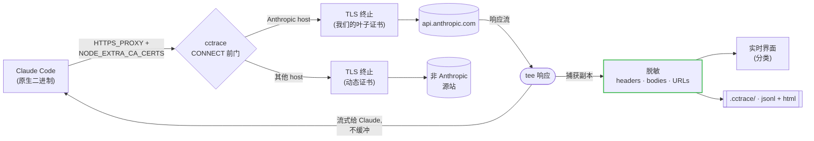

<p align="center"></p>

# cctrace

> **看看 Claude 到底发了什么。**
>
> Claude Code 发出的每一个请求 -- messages、OAuth、用量/额度、MCP --
> 全部实时呈现在你的浏览器里。

[English](README.md) | 简体中文

[](https://github.com/thevibeworks/cctrace/actions/workflows/test.yml)
[](https://github.com/thevibeworks/cctrace/tags)
[](LICENSE)
[](https://bun.sh)

<p align="center">
  
</p>

cctrace 卡在 Claude Code 和 Anthropic API 中间，把每一个 HTTP 请求记录到本地的分
类 Web 界面，结束后保存一份自包含的 HTML 快照，随时打开都能看。无云端、无账号，
数据不出你的机器。

```bash
cctrace
```

就这一行。Claude 照常启动，你多了一个浏览器标签页，里面是它干的所有事。

## 为什么需要它

cctrace 只为两件事而生：

1. **LLM 追踪** -- 看清 Claude Code 每轮到底发送和接收了什么：system prompt、
   上下文、工具定义、流式回复、token 与缓存用量。
2. **安全/隐私审计** -- 看清哪些请求从本机出站、去了哪些 host、有没有遥测、
   每个 payload 里实际带了什么。

这两件事都需要完整的图景 -- 每一个请求都得看到，而不只是好拿的那部分 -- 而做到
这一点比听起来难：

Claude Code 现在以 Bun 编译的**原生二进制**分发。过去用 `node --require` 注入
`fetch()` 钩子的做法，对原生二进制已经彻底失效 -- 那条路走不通了。cctrace 用的是
当下真正管用的方式：一个本地的 **TLS 拦截代理**（类似 Charles/mitmproxy，但零配
置）。Claude 通过 `HTTPS_PROXY` 走这个代理，并信任自动生成的 CA。

拦截发生在传输层 -- URL 还没拼出来的那一层 -- 所以它能看到**全部流量**，包括
base-url 代理在结构上就碰不到的 OAuth 和用量/额度端点（Claude 把那些 host 写
死了）。

## 你能得到什么

- **完整全貌。** `/v1/messages`、OAuth、**用量/额度**、MCP registry、bootstrap、
  遥测 -- 不只是聊天端点。
- **实时分类界面。** 带计数的筛选标签、彩色徽章、可展开的 headers/bodies、解码后
  的 SSE 流。界面做得不错，你会愿意一直开着它。
- **可分享快照。** 每次运行都写出一份自包含 `.html`，离线也能渲染同样的界面，不依
  赖服务器。发给同事就能看。
- **零配置。** 自动生成 CA、自动识别 Claude 安装、默认捕获全部。不用改配置文件，
  不用背参数。
- **默认安全。** 凭据在落盘前就已从 headers、bodies **和** URL 中脱敏（见
  [安全与隐私](#安全与隐私)）。你的 API key 还是你的 API key。

## 对比

|  | **cctrace** | base-URL 代理 | claude-trace (`node --require`) | Charles / mitmproxy |
|---|:---:|:---:|:---:|:---:|
| 支持原生二进制 | 是 | 是 | **否** | 是 |
| 捕获 `/v1/messages` | 是 | 是 | 是 | 是 |
| 捕获 **OAuth / 用量 / 额度** | 是 | **否** | **否** | 需手动 |
| 零配置（自动 CA 与信任） | 是 | 是 | 是 | **否** |
| 懂 Claude 的界面（分类、SSE 解码） | 是 | -- | 部分 | **否** |
| 纯本地，数据不外流 | 是 | 是 | 是 | 是 |

`fetch()` 钩子方案（claude-trace 之类）在 Claude Code 转原生之后就废了。base-URL
代理还能用，但只看得到 `/v1/messages` -- OAuth、用量、额度全是盲区。Charles 这类通
用 TLS 代理什么都看得到，但要手动装 CA，而且完全不理解 Claude 的端点。cctrace 走中
间路线：零配置、全覆盖、懂 Claude。

## 快速开始

需要 [Bun](https://bun.sh)、`openssl`，以及已安装的 Claude Code（`claude` 在
PATH 中）。

### 从 npm 安装

```bash
npm install -g @thevibeworks/cctrace
```

### 或直接运行（无需安装）

```bash
bunx @thevibeworks/cctrace
```

### 或克隆仓库

```bash
git clone https://github.com/thevibeworks/cctrace
cd cctrace
bun install
bun link            # 可选：把 `cctrace` 加入 PATH
```

### 或构建独立二进制（推荐）

```bash
git clone https://github.com/thevibeworks/cctrace
cd cctrace
make install        # 编译 dist/cctrace 并安装到 ~/.local/bin
```

`make install`（或 `make build`）用 `bun build --compile` 把 cctrace 编译成单个
可执行文件 -- 构建需要 Bun，**运行不需要**。它也是让 `cctrace -- <claude 参数>`
原样透传的安装方式（见下方透传说明）。`make help` 列出所有目标；
`PREFIX=/usr/local make install` 可更换安装位置。

然后直接运行：

```bash
cctrace                       # 捕获全部，打开实时界面
cctrace -- --continue         # 继续上一个 Claude 会话，并全程追踪
cctrace -- -p "hello"         # 把参数原样传给 Claude
```

启动后你会看到：

```
[cctrace] Live UI: http://localhost:9317
[cctrace] Capture: MITM proxy http://127.0.0.1:44775 (all Anthropic hosts)
```

打开 **Live UI** 链接即可看到请求实时流入。结束后按 Ctrl-C，cctrace 会打印保存的
`.cctrace/trace-<timestamp>.html` 路径。

## 运行方式（Bun 与 `bin`）

cctrace **跑在 [Bun](https://bun.sh) 上** -- CLI 就是直接执行的 `src/cli.ts`
（shebang `#!/usr/bin/env bun`）。没有编译后的 JS，也没有 Node 回退；底下全是
`Bun.serve`/`Bun.spawn`。

| 命令 | 可用 | 说明 |
|---|---|---|
| `cctrace`（`make install` 之后） | 是 | 编译后的二进制，运行不需要 Bun，`--` 原样透传 |
| `bun run src/cli.ts [args]` | 是 | 在克隆的仓库里 |
| `bun start` | 是 | 上一条的别名 |
| `./src/cli.ts` | 是 | 借助 Bun shebang 直接执行 |
| `cctrace`（`bun link` 之后） | 是 | 需要 `~/.bun/bin` 在 PATH 中；bun 会吃掉开头的 `--` |
| 无 Bun 的 `node .../cli.ts` / `npm i -g` | **否** | 会直接报错：`env: 'bun': No such file or directory` |

**三个前置条件缺一不可：**

- **Bun** -- 运行时，不只是安装工具。没有 Bun 就什么都跑不起来。
  [装一个](https://bun.sh)。
- **PATH 中的 `openssl`** -- `mitm` 模式靠它生成 CA 和叶子证书。没有 openssl？用
  `--mode base-url`（不需要 CA，但只能看到 messages）。
- **真正安装过的 Claude Code** -- 自动模式会读 `claude` 二进制的魔数来选捕获方式。
  PATH 里没有 `claude`？cctrace 会以 `Claude not found` 退出（或用 `--claude-path`
  手动指定）。

> **独立二进制：** `make build` 会为你的平台编译一个（`bun build --compile`），
> `make install` 会把它装进 PATH。唯一限制：编译后的二进制不含遗留的 `node`
> 捕获模式（它依赖仓库源码）-- 原生 Claude 安装本来就走默认的 `mitm`。

## 捕获模式

cctrace 会根据你的 Claude 安装自动选择；用 `--mode` 可强制指定。

| 模式 | 捕获范围 | 配置 |
|------|----------|------|
| **`mitm`**（原生二进制默认） | **全部** -- messages、OAuth、用量/额度、MCP、遥测 | 自动生成 CA；Claude 通过 `NODE_EXTRA_CA_CERTS` 信任它 |
| **`base-url`** | 仅 `/v1/messages` | 零配置 -- 只设置 `ANTHROPIC_BASE_URL` |
| **`node`**（npm/JS 安装自动选用） | 通过 `fetch()` 钩子捕获全部 | 遗留方案；仅适用于非原生（JS）Claude |

非 Anthropic 的 host 也会被**完整拦截** -- cctrace 会为每个 host 动态生成 TLS
证书（由同一个 CA 签发），因此你能看到 Claude 联系的所有目标的完整请求和响应。
外部流量在界面中有独立的筛选分类。

## Web 界面

- **行内摘要** -- 每行请求一眼可读：模型、输入/输出 token、缓存读/写与命中率、
  count_tokens 结果、用量窗口百分比（5h / 7d / 按模型）、遥测事件数、错误类型。
- **分类筛选标签**，带实时计数：Messages、Usage/Credits、OAuth、MCP、Bootstrap、
  Telemetry、Other。点击筛选，可与文本搜索组合。
- **分栏详情面板** -- 点击某行，详情在列表旁展开（可按请求 ID 深链）。Messages
  以对话形式呈现，流式回复从 SSE 解码；用量请求渲染成限额进度条；原始
  headers/bodies 折叠可查。`j`/`k` 在筛选后的列表中移动。
- **Session 视图** -- 网络请求与重建的对话左右并排：主对话与子代理运行
  （自动匹配到派发它们的 Task 调用）分线程展示，工具结果折叠进对应的工具调用，
  每个助手回合的 token/耗时都链接回产生它的请求。
- **会话续接** -- `cctrace -- --continue`（或 `--resume`）会接续上次被追踪的
  运行：Claude Code 的每个请求都在线上携带 session id，cctrace 据此在日志目录里
  精确匹配到之前运行的 trace 并合并进来。旧回合保留各自的 token、耗时和请求
  链接，不再是干巴巴的回放历史；合并进来的请求带 `prev` 徽标，可一键隐藏。
  `--fresh` 关闭合并；`--with FILE` 强制合并任意 trace 文件。
- **离线快照** -- 保存的 `.html` 内嵌完整 trace，无需服务器。一年后打开还是能用。

## 处理已保存的 trace

子命令直接作用于磁盘上已有的 trace -- 不启代理、不拉起 Claude。三个清理类命令
**默认 dry-run**（只打印将要处理的清单，不动任何文件），加 `--yes` 才真正执行。

```bash
# 重建快照 .html 并打开 -- 可用文件路径、session id 或文件名片段
cctrace view .cctrace/trace-2026-07-08T05-51-43.jsonl
cctrace view 4f9a2c1e                      # Claude Code 的 session id（可用前缀）

# 回收空间：删掉可重建的 .html 快照 + 0 字节的中断 trace
cctrace clean                              # dry-run：列出将删除的文件
cctrace clean --yes

# 合并：把一个 session 的多次运行（--continue 会跨文件）并成一个 .jsonl
cctrace merge                              # 每个 session 一个 session-<id>.jsonl
cctrace merge --prune --yes                # 同时删除已被完全合并的源文件

# 归档备份：gzip -9（view 能直接读 .jsonl.gz）
cctrace compress --older-than 7 --yes      # 只压缩 7 天前的 trace
```

清理绝不会让数据变少。`clean` 只删除源 `.jsonl`/`.jsonl.gz` 仍然存在的
`.html`（逐个检查，不是想当然 -- 孤儿快照会被保留）。`merge` 和 `compress`
会与已有的输出做并集，重复执行只会让合并文件或归档变大、不会变小。`merge`
只在源文件里**每一个** pair 都归属到某个 session 时才 prune 它，因此带有
OAuth/用量/遥测（无 session id）的 trace 绝不会被误删。每次删除前还会复查
文件在 plan 之后有没有变化，所以就算有 live 抓取正在追加写入，清理也是安全的。

## 选项

```
cctrace [OPTIONS] [-- CLAUDE_ARGS...]
```

| 选项 | 说明 |
|--------|-------------|
| `--mode MODE` | `auto`（默认）、`mitm`、`base-url`、`node` |
| `-s, --static` | 静态模式（不启动实时服务器，只写文件） |
| `-p, --port PORT` | 实时界面端口（默认 9317；被占用时自动回退） |
| `--messages-only` | 只捕获 `/v1/messages` |
| `--no-open` | 不自动打开浏览器 |
| `--print-ca` | 打印 MITM CA 证书路径并退出 |
| `--log NAME` | 自定义日志文件基名 |
| `--dir PATH` | 日志目录（默认 `.cctrace`） |
| `--fresh` | 续接会话时不合并之前的 trace |
| `--with FILE` | 把指定 trace 文件合并进视图（可重复） |
| `--claude-path PATH` | 自定义 Claude 二进制路径 |
| `--data-dir PATH` | MITM CA / 数据目录（默认 `~/.local/share/cctrace`；或用 `CCTRACE_DATA_DIR`。旧的 `--cache-dir` / `CCTRACE_CACHE_DIR` 仍然可用；0.6 之前留在 `~/.cache/cctrace` 的 CA 会自动迁移） |

### 把参数传给 Claude

`--` 之后的所有参数会原样传给 Claude CLI，之前的参数属于 cctrace：

```bash
cctrace -- --continue                       # claude --continue，全程追踪
cctrace -- -p "为什么会报错？"               # Claude print 模式，全程追踪
cctrace --mode base-url -- --model opus     # cctrace 选项 + Claude 选项
```

`--` 之前出现 cctrace 不认识的参数会直接报错并给出提示，不会被静默吞掉。
唯一需要注意的冲突：`-p` 在 `--` 之前是 cctrace 的端口，之后是 Claude 的
print 模式。

> **bun 运行方式的坑：** 通过 bun 的 CLI 运行时（`bunx`、`bun run`、
> `bun link` 的 shim），bun 自己会吃掉**开头的** `--`，于是
> `cctrace -- --help` 到达 cctrace 时变成了 `cctrace --help`。编译后的二进制
> （`make install`）没有这个问题 -- 这也是推荐的安装方式。若用 bun 方式运行，
> 在 `--` 前放任意一个 cctrace 选项即可（如 `cctrace --no-open -- --continue`）。

## 输出

每次运行都会写入 `.cctrace/`（或 `--dir`）：

- `trace-<timestamp>.jsonl` -- 每行一个请求/响应对（机器可读）
- `trace-<timestamp>.html` -- 自包含的分类查看器（人类可读）

## 工作原理



代理用自动生成的叶子证书（带 Anthropic SANs）终止 TLS，转发到真实 API，并对响应
流做 `tee` -- Claude 立即拿到字节，cctrace 同时抓一份副本，SSE 响应完全不缓冲。
每个捕获到的请求对，在进入任何落点之前都会先脱敏。

我们往 Claude 环境里注入 `HTTPS_PROXY`（让流量走我们的代理）和
`NODE_EXTRA_CA_CERTS`（它会把我们的 CA **追加**到 Bun 的信任库，于是 Claude 信任
我们的叶子证书，同时公网 TLS 照常工作）。

Claude 的子进程同样会继承 `HTTPS_PROXY` -- bash 工具里的 `curl`/`gh`、python
钩子、statusline 脚本 -- 而 `NODE_EXTRA_CA_CERTS` 对它们毫无意义，TLS 校验会
直接失败。所以我们为它们构建一份**合并证书包**（系统 CA + 我们的 CA -- 标准
环境变量是**替换**信任库而不是追加，只放 mitm 证书会弄坏所有不走代理的连接），
并导出为 `SSL_CERT_FILE`、`CURL_CA_BUNDLE`、`REQUESTS_CA_BUNDLE` 和
`NIX_SSL_CERT_FILE`：走代理的请求用我们的证书校验，直连的用系统 CA --
子进程根本不需要知道请求走了哪条路。

我们刻意**不**设置 `HTTP_PROXY` -- 前门只会说 CONNECT，设了会弄坏子进程的
明文 `http://` 调用。这种 bug 能让你凌晨两点开始怀疑人生。

## 安全与隐私

cctrace 是本地调试工具，但它拦截的是真实的带凭据流量，所以写入任何东西之前都会先
脱敏：

- **Headers** -- `authorization`、`x-api-key`、`cookie` 等被掩码为「前 10/后 4」
  的预览（足以判断用了**哪个** key，但看不到 key 本身）。
- **Bodies** -- 凭据字段（`access_token`、`refresh_token`、`client_secret`、
  `code`、`api_key` 等）在 JSON 和 form-encoded body 中被掩码。你的 `/v1/messages`
  对话内容保持原样。
- **URL** -- 携带凭据的查询参数（如 OAuth 的 `?code=`）被掩码。

脱敏在单一收口处完成，对 `.jsonl`、可分享的 `.html` 和实时 WebSocket 一视同仁。
`.cctrace/` 输出默认已在 gitignore 中。

**但请注意：** trace 就是你真实会话的记录。分享前请先检查，切勿把原始输出贴到公开
issue 里。真的别这么干。

## 路线图

- **Codex 支持** -- 用同一套 MITM 前门追踪 OpenAI Codex CLI。代理层本来就不挑
  agent，剩下的工作是 OpenAI host 过滤、端点分类，以及针对其线上格式的对话还原。
- **对话导出** -- 将还原的对话导出为 Markdown 或 JSON，方便分享或事后分析。
- **Agent Skill** -- 专门设计的 Claude Code skill / MCP 服务器，用于以编程方式与
  cctrace 交互：查询捕获的流量、检查特定请求、导出对话。
- **多会话实时视图** -- 同时运行多个 cctrace 会话而不端口冲突，每个会话路由到
  `http://localhost:9317/<project>/<session-id>` 的独立路径。
- **Token 指标** -- 每轮和累计 token 用量、缓存命中率、费用估算，以及
  `service_tier` / `inference_geo` 可见性。

已发布的变更见 [CHANGELOG.md](CHANGELOG.md)。

## 开发

```bash
bun test                                # 单元测试
bun run tests/e2e-live.ts mitm "hi"     # 对真实 Claude 做端到端测试
```

参见 [CONTRIBUTING.md](CONTRIBUTING.md)。

## 许可证

[MIT](LICENSE)
