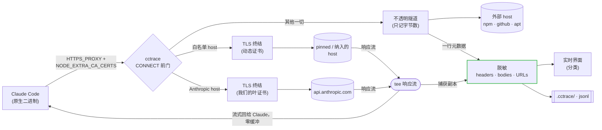

<p align="center"></p>

# cctrace

> **看看你的 coding agent 到底发了什么。**
>
> Claude Code 发出的每一个请求 -- messages、OAuth、用量/额度、MCP --
> 全部实时呈现在你的浏览器里。Codex、Grok、Kimi Code 同样支持。

[English](README.md) | 简体中文

[](https://github.com/thevibeworks/cctrace/actions/workflows/test.yml)
[](https://github.com/thevibeworks/cctrace/tags)
[](LICENSE)
[](https://bun.sh)

[文档](https://thevibeworks.github.io/cctrace/) · [安装](#快速开始) · [Web 界面](docs/web-ui.md) · [已保存的 trace](docs/traces.md) · [Claude 之外](docs/clients.md) · [llms.txt](llms.txt)

<sub>AI agent / LLM：请读 [/llms.txt](llms.txt)；agent skill 见 [skills/cctrace](skills/cctrace/SKILL.md)。</sub>

<p align="center">
  
</p>

cctrace 卡在 coding agent 和它的 API 中间，把每一个 HTTP 请求记录到本地的分类
Web 界面和一份 `.jsonl` trace，`cctrace view` 随时重开。无云端、无账号，数据
不出你的机器。

```bash
cctrace                # 追踪 Claude Code
cctrace codex          # 或 OpenAI Codex CLI
cctrace grok           # 或 Grok CLI
cctrace kimi           # 或 Kimi Code CLI（月之暗面）
```

就这一行。agent 照常启动，你多了一个浏览器标签页，里面是它干的所有事。

## 为什么需要它

cctrace 只为两件事而生：

1. **LLM 追踪** -- 看清 agent 每轮到底发送和接收了什么：system prompt、
   上下文、工具定义、流式回复、token 与缓存用量。
2. **安全/隐私审计** -- 看清哪些请求从本机出站、去了哪些 host、有没有遥测、
   每个 payload 里实际带了什么。

这两件事都需要完整的图景 -- 每一个请求都得看到，而不只是好拿的那部分。
Claude Code 以 Bun 编译的**原生二进制**分发，`node --require` 注入 `fetch()`
钩子的老路已经彻底失效。cctrace 在传输层拦截：一个零配置的 **TLS 拦截代理**
（类似 Charles），agent 通过 `HTTPS_PROXY` 走它，并信任自动生成的 CA。拦截
发生在 URL 拼出来之前的那一层，所以 base-url 代理在结构上碰不到的 OAuth 和
用量/额度端点也尽收眼底 -- 从 0.16 起这个范围是刻意为之：第一方 host 才解密，
其他一切（npm、GitHub、apt）都以不解密的字节计数隧道透传。

## 你能得到什么

- **完整全貌。** `/v1/messages`、OAuth、**用量/额度**、MCP registry、bootstrap、
  遥测 -- 不只是聊天端点。
- **实时分类界面。** 带计数的筛选标签、解码后的 SSE 流、prompt 缓存判定、
  首 token 延迟、每请求的估算费用。完整导览见 [docs/web-ui.md](docs/web-ui.md)。
- **会话重建。** 线程、子代理分支、`/model` epoch、compact 分界、被覆盖的交互 --
  外加**回放**：任何已捕获的会话都能逐轮播放，任意时刻可深链。
- **可重开的 trace。** 每次运行写一份 `.jsonl`；`cctrace view` 随时重开，
  `--html` 按需渲染离线快照发给同事。
- **零配置。** 自动生成 CA、自动识别安装，默认捕获完整的第一方全貌。
- **范围即设计。** agent 子进程碰到的外部 host 以不透明隧道透传（只记 host +
  字节数），`go install` 再也不会往 trace 里塞 53MB 的 tarball。细节见
  [捕获模式](docs/capture-modes.md)。
- **默认安全。** 凭据在落盘前就已从 headers、bodies **和** URL 中脱敏（见
  [安全与隐私](#安全与隐私)）。

## 对比

|  | **cctrace** | base-URL 代理 | claude-trace (`node --require`) | Charles / mitmproxy |
|---|:---:|:---:|:---:|:---:|
| 支持原生二进制 | 是 | 是 | **否** | 是 |
| 捕获 `/v1/messages` | 是 | 是 | 是 | 是 |
| 捕获 **OAuth / 用量 / 额度** | 是 | **否** | **否** | 需手动 |
| 零配置（自动 CA 与信任） | 是 | 是 | 是 | **否** |
| 懂 agent 的界面（分类、会话、SSE 解码） | 是 | -- | 部分 | **否** |
| 纯本地，数据不外流 | 是 | 是 | 是 | 是 |

`fetch()` 钩子方案（claude-trace 之类）在 Claude Code 转原生之后就废了。base-URL
代理还能用，但只看得到 `/v1/messages`。Charles 这类通用 TLS 代理什么都看得到，
但要手动装 CA，而且完全不理解这些端点。cctrace 走中间路线：零配置、全覆盖、
懂你的 agent。

## 快速开始

需要 [Bun](https://bun.sh)、`openssl`，以及你要追踪的 CLI。

```bash
npm install -g @thevibeworks/cctrace    # 或：bunx @thevibeworks/cctrace
```

或构建独立二进制（推荐 -- 运行时不需要 Bun，`--` 原样透传）：

```bash
git clone https://github.com/thevibeworks/cctrace && cd cctrace
make install                            # 编译并安装到 ~/.local/bin
```

然后：

```bash
cctrace                                    # 追踪 claude，打开实时界面
cctrace -- --continue                      # 续上上一次会话，带追踪
cctrace -- -p "hello"                      # -- 之后的参数原样传给 agent
```

```
[cctrace] Live UI: http://localhost:9317
[cctrace] Capture: MITM proxy http://127.0.0.1:44775 (all Anthropic hosts)
```

打开 Live UI 看请求流入。结束按 Ctrl-C -- `.jsonl` 留在 `.cctrace/`，随时
`cctrace view` 重开。安装变体、运行时说明和 bun 的 `--` 坑见
[docs/install.md](docs/install.md)。

## 常用命令

```bash
cctrace view                     # 重开已保存的 trace（回车 = 最新）
cctrace view <target> --html     # 渲染可分享的离线快照
cctrace ps                       # 存活实例：URL、client、项目、会话
cctrace clean|merge|compress     # 清理归档 -- 默认 dry-run，--yes 才执行
cctrace purge                    # 从已保存 trace 中删除噪音类别
cctrace compact                  # 折叠冗余请求体（-95%+），会话视图不变
```

清理命令永不缩水你的数据（删除前校验、合并取并集、对正在写入的 trace 安全）；
`compact` 是唯一声明过的例外。完整保证见 [docs/traces.md](docs/traces.md)。

## 常用选项

| 选项 | 说明 |
|--------|-------------|
| `--mode MODE` | `auto`（默认）、`mitm`、`base-url`、`node` |
| `-p, --port PORT` | Live UI 端口（默认 9317，被占自动顺延） |
| `--messages-only` | 只捕获模型 API 调用 |
| `--capture-external` | 解密所有 host（超 64KB 的外部 body 只留摘要） |
| `--intercept-host H` | 额外解密 host `H`（可重复 -- 远程 MCP 服务器） |
| `--dir PATH` | 日志目录（默认 `.cctrace`） |
| `--client-path PATH` | 任意 client 的自定义二进制路径 |

完整表格（含 `--fresh`、`--with`、`--data-dir`、`--print-ca`）：
[docs/install.md](docs/install.md#all-options)。

## 工作原理



代理用自动生成的叶证书终结 TLS，转发到真实 API，并对响应流做 `tee` -- agent
立即拿到字节，cctrace 同时留副本，SSE 零缓冲。每个捕获的请求对在进入任何
输出前都先脱敏。子进程信任（合并 CA bundle）、为什么不设 `HTTP_PROXY`、
隧道范围模型：[docs/capture-modes.md](docs/capture-modes.md)。

## 安全与隐私

cctrace 是本地调试工具，但它拦截的是真实的带凭据流量，所以落盘前先脱敏：

- **Headers** -- `authorization`、`x-api-key`、`cookie` 等掩码为前 10/后 4
  预览（够分辨是哪把 key，拿不到 key 本身）。
- **Bodies** -- 凭据字段（`access_token`、`refresh_token`、`client_secret`、
  `api_key` 等）在 JSON 和表单里掩码。对话内容原样保留。
- **URLs** -- 带凭据的查询参数（如 OAuth `?code=`）掩码。

脱敏发生在唯一的收口点，对 `.jsonl`、`.html`、实时 WebSocket 一视同仁。
`.cctrace/` 输出默认在 gitignore 里。

**但是：** trace 是你真实会话的记录。分享前先自查。永远不要把原始输出贴进
公开 issue。真的。

## 文档

| 入门 | 深入 |
|---|---|
| [安装与选项](docs/install.md) | [捕获模式与代理内部](docs/capture-modes.md) |
| [Web 界面导览](docs/web-ui.md) | [trace 管理与清理保证](docs/traces.md) |
| [Codex / Grok / Kimi / 兼容服务](docs/clients.md) | [Agent skill](skills/cctrace/SKILL.md) · [CHANGELOG](CHANGELOG.md) |

## 路线图

- **会话回放 P3/P4** -- 可选 `--record-timing`，按块计时的流式回放
  （[设计文档](docs/design/session-replay.md)）。
- **WebSocket 中继** -- 捕获 ws 帧，替代当前的快速拒绝 + HTTP 回退。
- **对话导出** -- 把重建的对话导出为 Markdown 或 JSON。
- **MCP 服务器** -- 让任意 agent 以编程方式查询捕获的流量（agent *skill*
  已内置；MCP 是剩下的一半）。
- **隧道 PID 归因** -- 哪个子进程调了 npm（Linux，已调研，暂缓）。

## 开发

```bash
bun test                                # 单元测试
bun run tests/e2e-live.ts mitm "hi"     # 对真实 Claude 的端到端测试
```

见 [CONTRIBUTING.md](CONTRIBUTING.md)。

## 许可证

[MIT](LICENSE)
