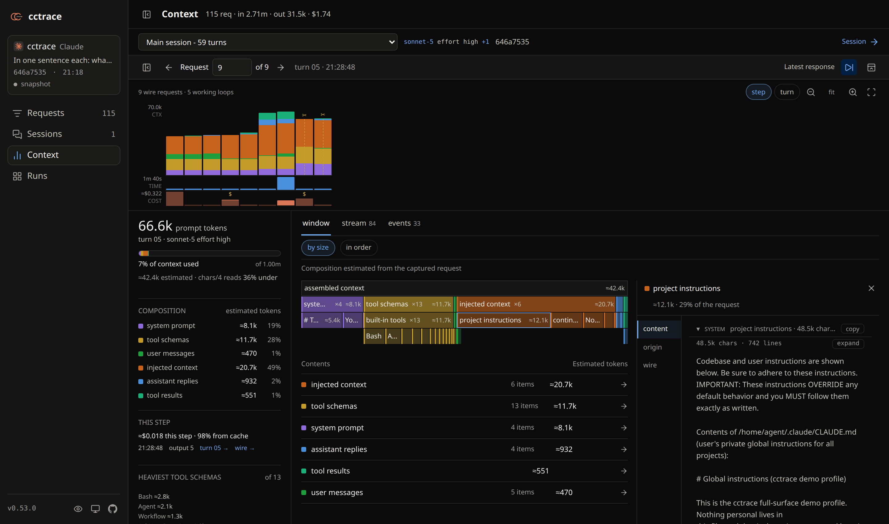

<p align="center"></p>

<h1 align="center">cctrace</h1>
<p align="center"><strong>看清整个 Agent 会话。</strong><br>跟随工作过程，找出上下文占用，查看背后的每一次请求。</p>

<p align="center">
  <a href="https://github.com/thevibeworks/cctrace/actions/workflows/test.yml"></a>
  <a href="https://www.npmjs.com/package/@thevibeworks/cctrace"></a>
  <a href="LICENSE"></a>
</p>

<p align="center"><a href="https://thevibeworks.github.io/cctrace/">交互导览</a> · <a href="#快速开始">安装</a> · <a href="docs/web-ui.md">文档</a> · <a href="README.md">English</a></p>

[](https://thevibeworks.github.io/cctrace/demo/sample.html#/context)

*当前界面，展示 cctrace 捕获的一次真实 Claude Code 会话（沙箱运行并已脱敏，[制作方式](docs/demo/capture.sh)）。[打开它，探索上下文、回放会话，或查看请求。](https://thevibeworks.github.io/cctrace/demo/sample.html#/context)*

cctrace 记录编程 Agent 的 API 流量，并将其变成本地可探索的会话。
支持 **Claude Code、Codex、Grok、Kimi Code 和 opencode**；
[各客户端的捕获范围有所不同](docs/clients.md)。

- **发生了什么？** 按人的工作轮次阅读，跟随工具和子 Agent，回放整个过程。
- **什么占满了上下文？** 查看指令、工具 schema 和工具结果的变化，了解压缩改了什么。
- **Tokens 花在哪了？** 查看会话内和跨次运行的缓存行为与估算费用。
- **到底发送了什么？** 打开捕获的请求和响应，包括模型调用以外的第一方流量。

## 快速开始

需要 [Bun](https://bun.sh)、`openssl`，以及你要追踪的 Agent CLI。

```bash
npm install -g @thevibeworks/cctrace
cctrace                              # 启动 Claude Code 和本地网页界面
```

终端会打印 Live UI 地址。照常使用 Agent，浏览器中会实时显示请求。
Trace 会保存下来，方便之后查看。

```bash
cctrace codex                        # 也支持 grok、kimi、opencode
cctrace view                         # 重新打开保存的会话
cctrace doctor                       # 诊断当前或最近一次会话的上下文
cctrace insights --scan              # 查看多次运行的用量和缓存
cctrace export                       # 将会话导出为 Markdown
```

独立二进制安装及 Agent 参数透传，见[安装方式](docs/install.md)。

## 安全与隐私

cctrace 在本地运行 TLS 拦截代理。默认解密第一方 host，其他 host 通过
不透明隧道转发。凭证字段在写入前脱敏。**对话内容会保留**，分享 trace 前
请检查。cctrace 不会把捕获数据上传到服务；Agent 仍会连接其配置的提供商。
[捕获范围](docs/capture-modes.md) · [脱敏细节](SECURITY.md)。

## 深入了解

[Web UI](docs/web-ui.md) · [保存的 trace](docs/traces.md) · [客户端](docs/clients.md)
· [实时捕获与资源](docs/live-resources.md) · [更新日志](CHANGELOG.md)

**给 Agent：** [llms.txt](llms.txt) · [cctrace skill](skills/cctrace/SKILL.md)
· [上下文诊断](skills/cctrace-doctor/SKILL.md) · [用量洞察](skills/cctrace-insights/SKILL.md)。
CLI 计算事实，skill 帮助 Agent 解读。

[贡献指南](CONTRIBUTING.md) · [MIT 许可证](LICENSE)。
